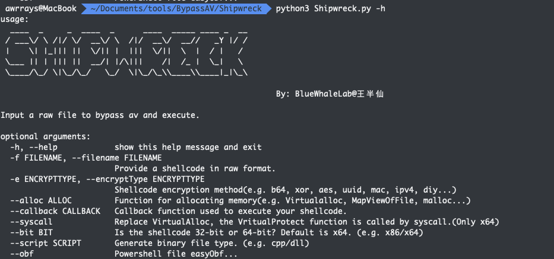
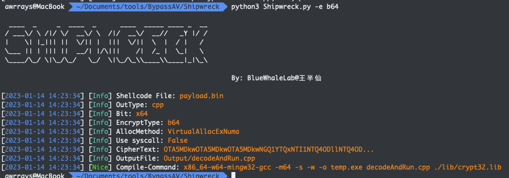
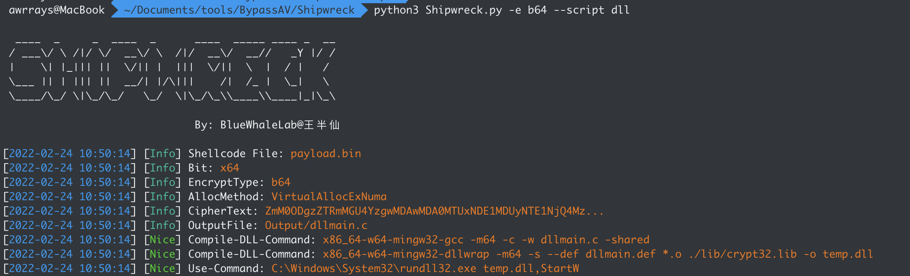
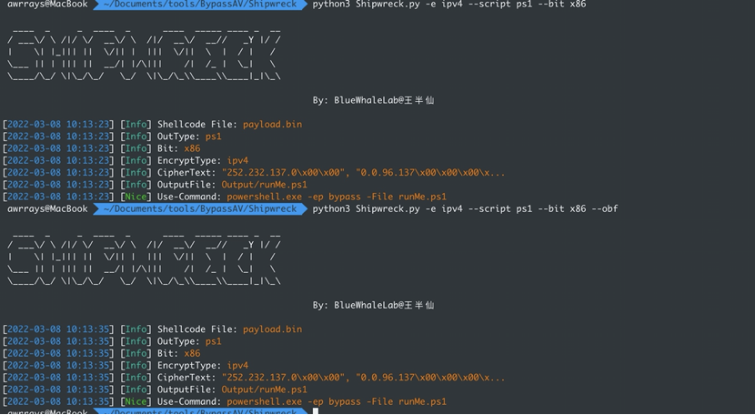
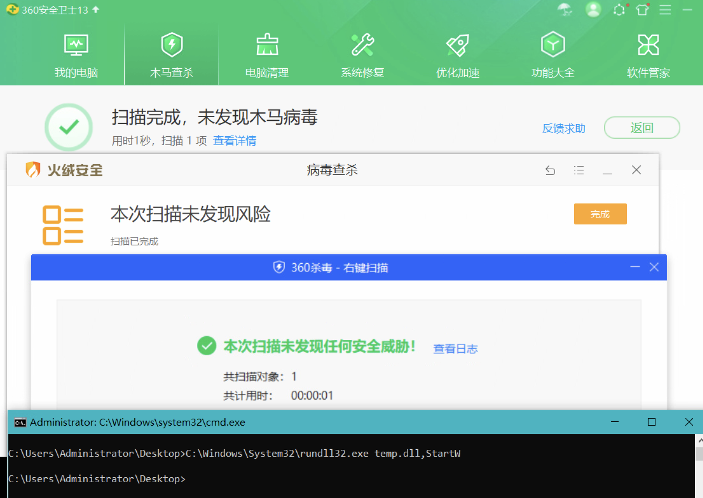

# Shipwreck

Input a raw file to bypass av and execute.

一个只需要提供shellcode文件的免杀框架，可输出exe/dll/ps1

**编译需要mingw套件**



## Usage

```sh
usage:
  ____  _     _  ____  _      ____  _____ ____ _  __
 / ___\/ \ /|/ \/  __\/ \  /|/  __\/  __//   _Y |/ /
 |    \| |_||| ||  \/|| |  |||  \/||  \  |  / |   /
 \___ || | ||| ||  __/| |/\|||    /|  /_ |  \_|   \
 \____/\_/ \|\_/\_/   \_/  \|\_/\_\\____\\____|_|\_\

							  By: BlueWhaleLab@王半仙

Input a raw file to bypass av and execute.

optional arguments:
  -h, --help            show this help message and exit
  -f FILENAME, --filename FILENAME
                        Provide a shellcode in raw format.
  -e ENCRYPTTYPE, --encryptType ENCRYPTTYPE
                        Shellcode encryption method(e.g. b64, xor, aes, uuid, mac, ipv4, diy...)
  --alloc ALLOC         Function for allocating memory(e.g. Virtualalloc, MapViewOfFile, malloc...)
  --callback CALLBACK   Callback function used to execute your shellcode.
  --syscall             Replace VirtualAlloc, the VritualProtect function is called by syscall.(Only x64)
  --bit BIT             Is the shellcode 32-bit or 64-bit? Default is x64. (e.g. x86/x64)
  --script SCRIPT       Generate binary file type. (e.g. cpp/dll)
  --obf                 Powershell file easyObf...
```

### Filename

默认为**payload.bin**, raw格式

```sh
-f FILENAME, --filename FILENAME
                        Provide a shellcode in raw format.
```

### EncryptType

当前只完成了b64、xor、uuid、mac、ipv4。aes尚未完成、diy自己写算法。

该参数为必选

```sh
-e ENCRYPTTYPE, --encryptType ENCRYPTTYPE
                        Shellcode encryption method(e.g. b64,xor,aes,diy...)
```

- Base64
- Xor
- ~~Aes~~
- Uuid
- Mac
- IPv4
- DIY

### Alloc

默认申请内存为VirtualAllocExNuma，不可与syscall同用

申请内存方式参考[Schrodinger-s-Cat](https://github.com/idiotc4t/Schrodinger-s-Cat)，malloc，calloc，MapViewOfFile申请内存方式存在问题，有成功了的交流一下

```sh
--alloc ALLOC         Function for allocating memory(e.g. Virtualalloc, HeapAlloc)
```

- VirtualAllocExNuma
- Virtualalloc
- HeapAlloc
- ~~Malloc~~
- ~~Calloc~~
- ~~MapViewOfFile~~

### CallBack

选定回调函数、template目录下的cpp皆可，可自己添加，默认为CertEnumSystemStore

当前有36个可用callback，用来代替经典的CreateThread来执行shellcode

```sh
--callback CALLBACK   Callback function used to execute your shellcode.
```

- CertEnumSystemStore         
- CertEnumSystemStoreLocation 
- CopyFile2                   
- CreateThreadPoolWait        
- CreateTimerQueueTimer       
- CryptEnumOIDInfo            
- EnumChildWindows            
- EnumDesktopWindows          
- EnumDesktopsW               
- EnumDirTreeW                
- EnumDisplayMonitors         
- EnumFontFamiliesExW         
- EnumFontFamiliesW           
- EnumFontsW                  
- EnumLanguageGroupLocalesW   
- EnumObjects                 
- EnumPageFilesW              
- EnumPropsExW                
- EnumPropsW                  
- EnumPwrSchemes              
- EnumResourceTypesExW        
- EnumResourceTypesW          
- EnumSystemLocalesEx         
- EnumTimeFormatsEx           
- EnumUILanguagesW            
- EnumWindowStationsW         
- EnumWindows                 
- EnumerateLoadedModules      
- ImageGetDigestStream        
- ImmEnumInputContext         
- InitOnceExecuteOnce         
- SetTimer                    
- SetupCommitFileQueueW       
- SymEnumProcesses            
- SymFindFileInPath           
- VerifierEnumResource        

### Syscall

修改VirtualAlloc、VritualProtect为syscall调用，仅支持64位

使用了[SysWhispers2](https://github.com/jthuraisamy/SysWhispers2)项目生成syscall.h，有精力可以用[SysWhispers3](https://github.com/klezVirus/SysWhispers3)重新生成一个，SysWhispers3已支持32位

```sh
--syscall             Replace VirtualAlloc, the VritualProtect function is called by syscall.(Only x64)
```

### BIT

shellcode位数，32位需更换output/lib下sdk为32位，目前放的都是64位的

默认为64位

```sh
--bit BIT             Is the shellcode 32-bit or 64-bit? Default is x64. (e.g. x86/x64)
```

### Script

输出结果类型 exe/dll/ps1，默认为exe

```sh
--script SCRIPT       Generate binary file type. (e.g. cpp/dll/ps1)
```

- cpp
- dll
- ps1

一个go版本的callback加载器库，可以集成进来。

[golang实现的回调函数加载器库](https://github.com/nu1r/GolangCallbackLoader)

#### EXE

不指定`--script`默认为exe，切换到output目录下，使用输出信息中的`Compile-Command`编译即可

gcc去除黑窗口：`-mwindows`



#### DLL

指定`--script`为dll，切换到output目录下，使用输出信息中的`Compile-Command`编译即可

生成的dll导出函数为`StartW`



#### PS1

指定`--script`为ps1, 可使用`--obf`参数对生成的ps1文件进行混淆



## Technology

- Shellcode加密，应对静态查杀
- 同功能可替代api替换，应对api hook
- ...

## Update

[2022-03-14 1.1.1] 增加输出ps1功能，使用`--script ps1`参数，默认为ps1

[2022-02-24 1.1.0] 增加输出dll功能，使用`--script dll`参数，默认为cpp

[2022-01-17 1.0.2] 增加VirtualAlloc、HeapAlloc申请内存方式，使用`--alloc`参数

[2022-01-01 1.0.1] 增加uuid、Mac、ipv4内存加载，使用`-e`参数 

[2021-12-15 1.0] Shipwreck1.0完成

22年年初刚写完这个框架的测试图



## TODO

1. 完善AES加密
2. 添加内存混淆
3. 输出vba、~~ps1~~、py等脚本
4. ...

## 不要传VT/WB...！

## 不要传VT/WB...！

## 不要传VT/WB...！
