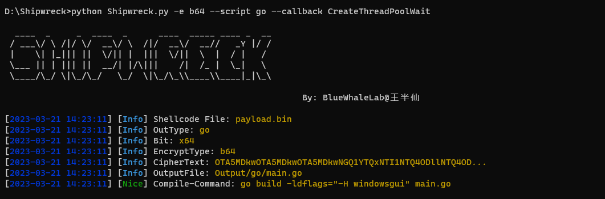
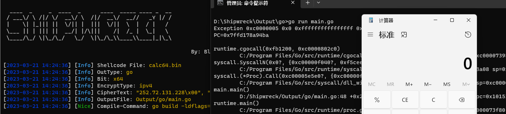

# 1.2.0

用法参照[这里](https://github.com/Awrrays/Shipwreck/blob/main/OLD.md)

新增go bypass

```sh
python Shipwreck.py -e b64 --script go
```





可用Callback参照：

https://github.com/nu1r/GolangCallbackLoader

